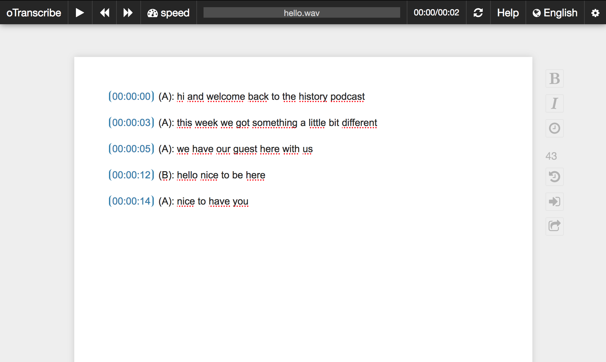

# autoTemplater
Create automatically diarized and transcribed oTranscribe templates

### Installation

```
git clone https://github.com/translatorswb/autotemplater.git
cd autotemplater
pip install -r requirements.txt
```

### Usage

Only diarization:
```
python autotemplater.py -i audio.wav 
```

Transcribe with locally running [ASR-API](https://github.com/translatorswb/ASR-API)
```
python autotemplater.py -i audio.wav -x api -l en
```

Transcribe with remotely running [ASR-API](https://github.com/translatorswb/ASR-API)
```
python autotemplater.py -i audio.wav -x api -l en -u <remote-asr-api-endpoint>
```

Transcribe with Azure speech SDK
```
python autotemplater.py -i audio.wav -x azure -l en-US -a <azure-subscription-key> -r <azure-region>
```

### Template options

Using `-s` or `--sid` will insert speaker labels at each turn (off by default):
```
00:00:00 (A): hi and welcome back
00:00:03 (B): hello nice to be here
```

Take turn on segment (`-t segment`) is selected by default. A timestamp is inserted everytime a speech segment is detected. For example: 
```
00:00:00 (A): hi and welcome back to the history podcast
00:00:03 (A): this week we got something a little bit different
00:00:05 (A): we have our guest here with us
00:00:12 (B): hello nice to be here
00:00:14 (A): nice to have you
```

Take turn on speaker change (`-t speaker`) will put timestamps only when there's a speaker change. For example:
```
00:00:00 (A): hi and welcome back to the history podcast this week we got something a little bit different we have our guest here with us
00:00:12 (B): hello nice to be here
00:00:14 (A): nice to have you
```

### Output files

Output files are as follows:

- `file-diarization.otr`: oTranscribe template with timestamps only (and without transcription)
- `file-diarization.json`: Raw diarization output (for debugging purposes)
- `file-transcript.txt`:  Plain text transcript with timestamps
- `file-autotemplate.otr`: oTranscribe template with timestamps and transcription

You can also specify a different output directory by using `-o` flag
```
python autotemplater.py -i audio.wav -o <output-directory-path>
```

### Post-editing on oTranscribe

Automatic speech recognition (ASR) makes errors. If you want to do post-editing on the output, go to [otranscribe.com](https://otranscribe.com/), load your audio file and then import your template file (`.otr`). You can then easily post-edit while listening to your audio. 


